# Каталог блоков

11 слайдов-паттернов, извлечённых из готовой презентации
(`html/superqr-meta-ads-audit/`). Каждый — самостоятельный `<section
class="slide ...">…</section>`, который можно вставить в новую презентацию
как есть и подправить текст/картинки/числа. Классы берутся из
`shared/css/deck.css` — сам блок ничего не описывает заново.

Собирать новую презентацию — значит **не писать разметку с нуля**, а
выбрать подходящие блоки ниже, скопировать в `
…
`
(см. `shared/templates/slide-deck.html`) и отредактировать текст. Внутри
каждого файла — комментарий сверху: когда использовать блок и что именно
менять.

| Блок | Превью | Когда использовать |
|---|---|---|
| [`cover-split.html`](cover-split.html) | 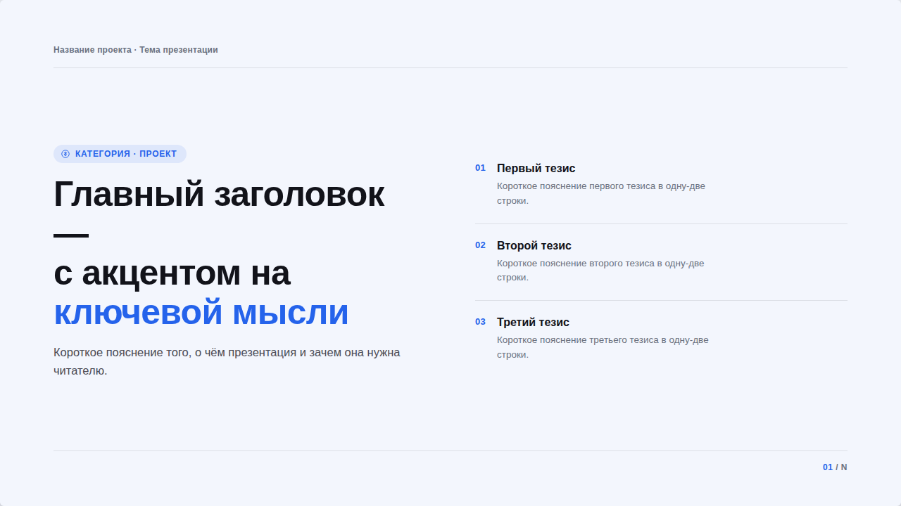 | Титульный слайд: заголовок слева, 2–3 главных тезиса справа |
| [`grid-summary.html`](grid-summary.html) | 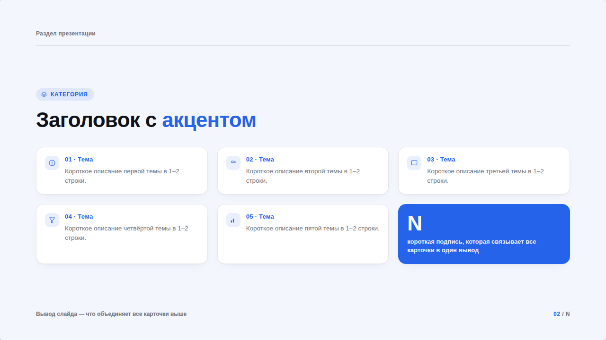 | Обзор разделов/находок — сетка карточек + акцентная карточка со сводной цифрой |
| [`evidence-single.html`](evidence-single.html) | 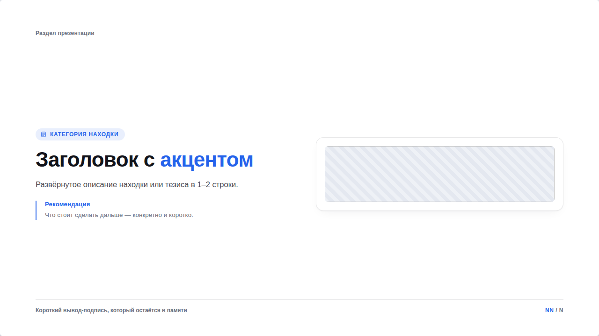 | Один скриншот-доказательство + вывод + рекомендация — самый частый блок |
| [`evidence-dual.html`](evidence-dual.html) | 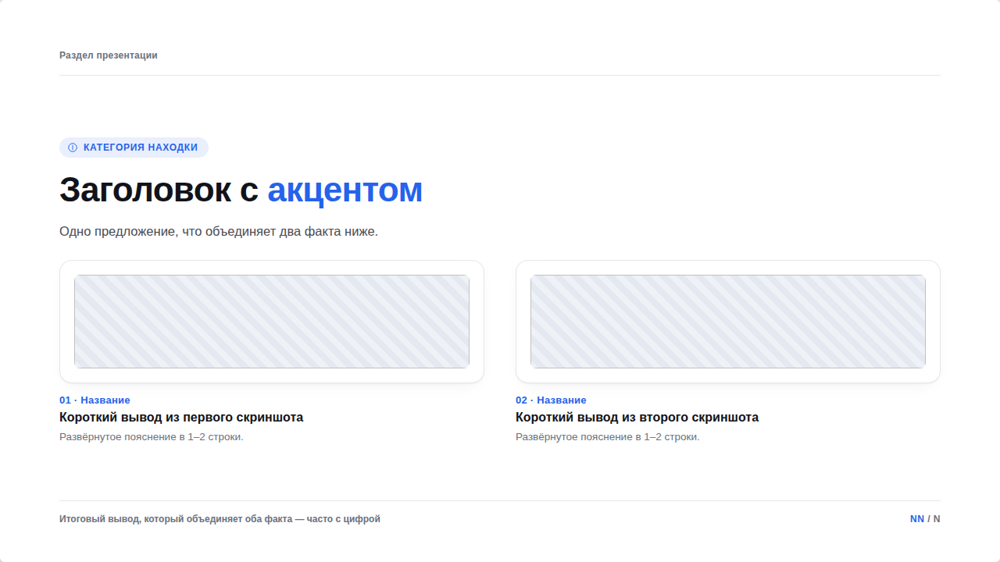 | Два скриншота рядом, у каждого своя короткая подпись |
| [`evidence-comparison.html`](evidence-comparison.html) | 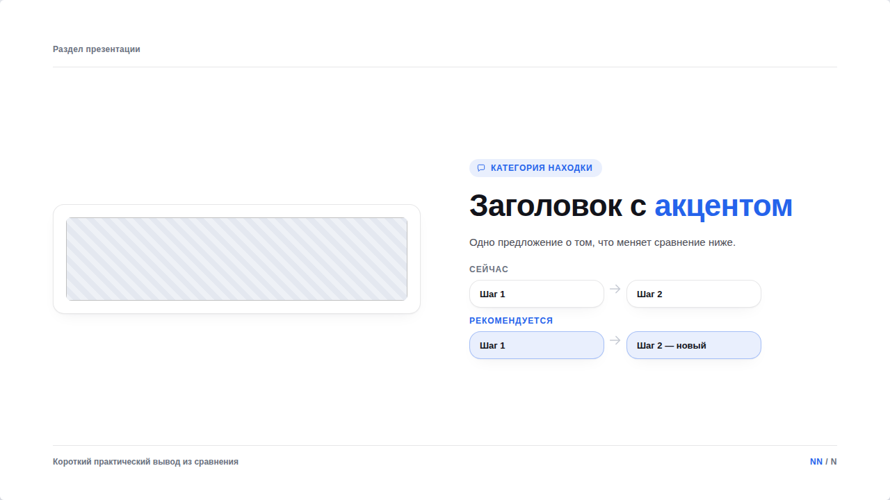 | Скриншот + текст + мини-диаграмма «сейчас / рекомендуется» |
| [`stat-split.html`](stat-split.html) | 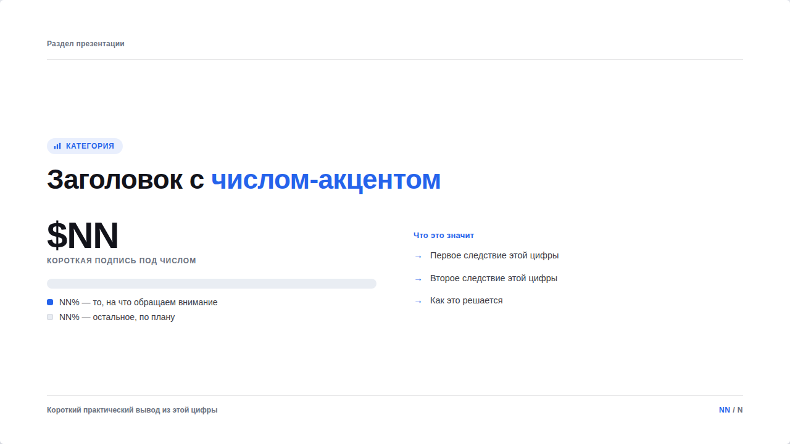 | Одна цифра как доля от целого (полоска), а не два числа текстом |
| [`flow-diagram.html`](flow-diagram.html) | 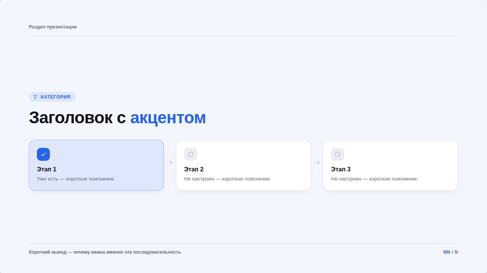 | Воронка/процесс/этапы — связанные узлы со стрелками и статусом (есть/нет) |
| [`concept-checklist.html`](concept-checklist.html) | 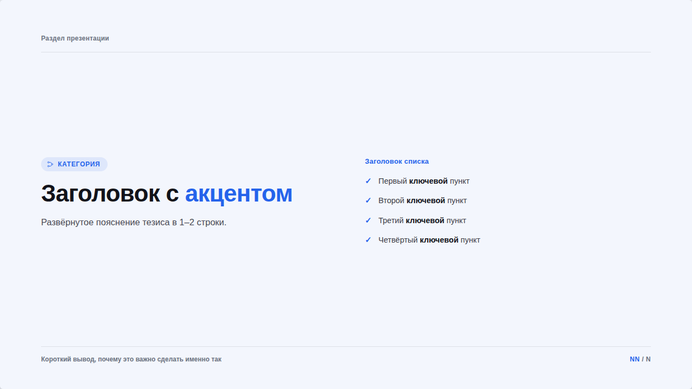 | Тезис без скриншота + чек-лист из 3–5 пунктов |
| [`image-gallery.html`](image-gallery.html) | 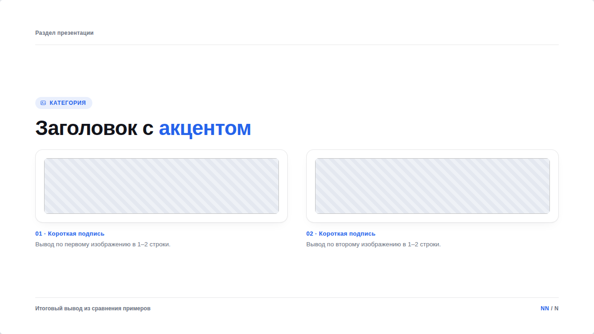 | Несколько изображений в ряд для сравнения (креативы, макеты) |
| [`stepper-roadmap.html`](stepper-roadmap.html) | 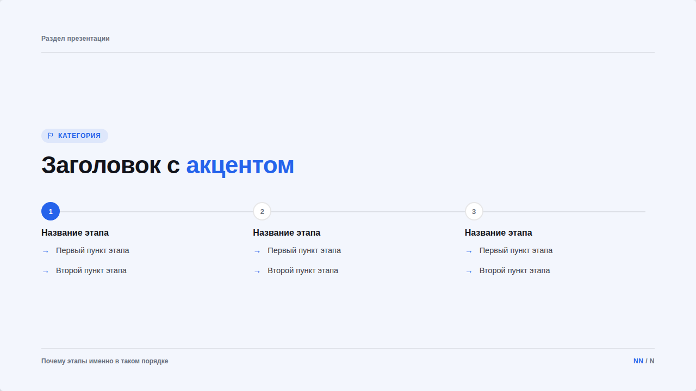 | План внедрения на N этапов на одной шкале |
| [`metrics-table.html`](metrics-table.html) | 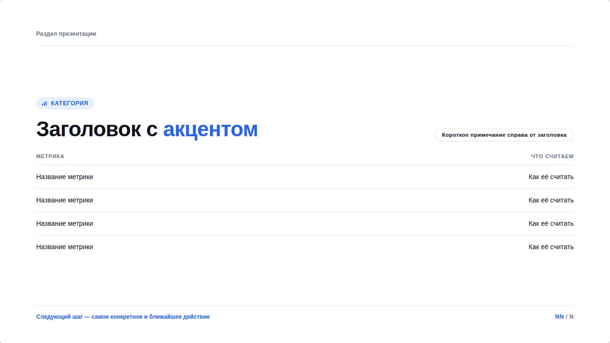 | Закрывающий слайд — таблица метрик + пилюля-примечание |

## Как собрать презентацию из блоков

1. Скопировать `shared/templates/slide-deck.html` в `html/<slug>/index.html`
2. Для каждого нужного слайда — открыть подходящий блок отсюда, скопировать
   его `<section>…</section>` в `
`, поправить текст/картинки/
   числа по комментарию в начале файла
3. Проверить нумерацию `<b class="num">NN</b> / N` на каждом слайде и в `#total`
4. `node scripts/inline-deck.mjs <slug>` — встроить CSS/JS/картинки, чтобы
   файл можно было переслать одним куском
5. PDF — по желанию, вручную через кнопку «🖨 PDF» в самой презентации
   (см. «Экспорт в PDF» в корневом README — автоскрипт сейчас не используем)

## Правила, которые уже прошиты в блоки (не нарушать при адаптации)

- **Одна сетка на слайд.** Если карточек несколько рядов — они должны быть
  в одном `.cols`, а не в двух разных с разным числом колонок (иначе ряды
  не выравниваются — так появился «хаос» на одном из первых вариантов).
- **Статус — не только цветом.** В `flow-diagram` «есть» и «нет» различаются
  и цветом, и формой иконки (галочка vs пунктирный круг).
- **Тени только на экране.** `.card`/`.pill` используют `box-shadow`, но он
  выключен в `@media print` — в headless Chromium размытая тень с
  отрицательным spread на печати превращается в жёсткий серый прямоугольник;
  для PDF остаётся только рамка.
